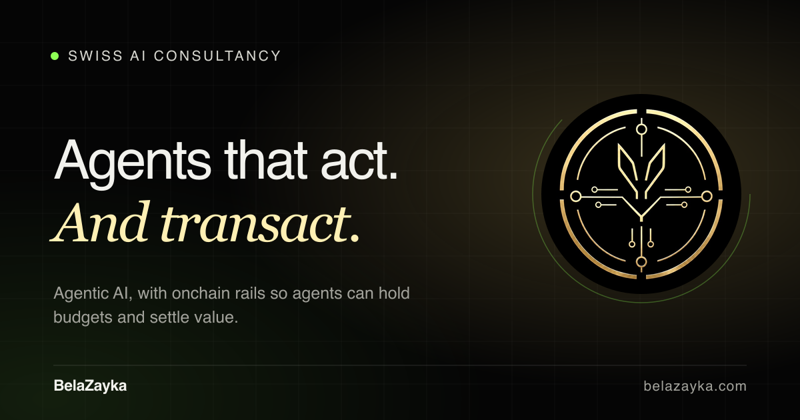

# BelaZayka

**Agents that act. And transact.**

BelaZayka is a Swiss consultancy building agentic AI — autonomous systems that do real work inside real organisations — and, where agents need economic agency, the onchain rails that let them hold budgets, pay for what they use and settle value.

Agentic AI is easy to demonstrate and hard to depend on. We close that gap with engineering discipline: clear scope, measurable behaviour, and limits that hold when the agent meets real users and real money.

---

## Expertise

**Agentic systems & orchestration**
Multi-step agents that plan, call tools and hand off to people at the right moment — designed around how your organisation actually operates.
`Tool use` `Planning` `Multi-agent` `Human oversight`

**Agent payments & onchain settlement**
Programmable accounts, spend policy enforced in code and settlement that clears in seconds — so an agent can transact as an accountable economic actor.
`Programmable wallets` `Spend limits` `Stablecoin rails` `Onchain audit trail`

**Generative AI & machine learning**
LLM applications, retrieval, evaluation pipelines and the models and decision systems underneath them — built to hold up under production traffic.
`RAG` `Evaluation` `Fine-tuning` `Decision systems`

**AI architecture, LLMOps & governance**
Secure foundations, observability, cost control and delivery practice that keep autonomous systems accountable once they are live.
`Observability` `Guardrails` `Security` `Cost control`

**Smart contracts & onchain infrastructure**
Contracts, tokenisation and decentralised infrastructure — as the financial plumbing beneath your agents, or as a system in its own right.
`Solidity` `Account abstraction` `Tokenisation` `Self-sovereign identity`

---

## An agent without a budget is just a chatbot

Genuine autonomy means an agent can commit resources — buy the data it needs, pay for the compute it consumes, settle with another service — **inside limits you set and can prove**.

| Identity | Authority | Settlement |
| --- | --- | --- |
| Every agent gets its own account, keys and provable history, so an action attributes to an actor. | Limits, allowlists and approval thresholds enforced by the contract rather than by a prompt. | Value moving between agents, services and people in seconds, with a receipt that reconciles itself. |

---

## Approach

1. **Frame** — Define the decision, workflow or constraint that matters, and exactly what the agent is allowed to do, before choosing a model.
2. **Prove** — Build a narrow prototype and test it against evidence: evaluations, failure modes and real cost. Not a polished demo.
3. **Engineer** — Turn what works into a secure, observable system with enforced limits that your team can operate, audit and extend.

---

## Contact

Have a difficult AI problem? Whether it is an agent that has to act in the real world, or a system that has to be trusted with money, we are glad to look at it with you.

- Website — [belazayka.com](https://www.belazayka.com)
- Email — [info@zayka.dev](mailto:info@zayka.dev)
- LinkedIn — [linkedin.com/company/belazayka](https://linkedin.com/company/belazayka)

© 2026 BelaZayka GmbH · Wädenswil, Switzerland · CHE-362.190.661
